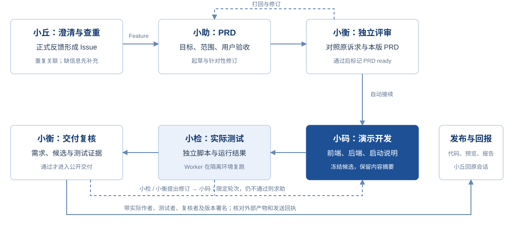

# Steward · Octo 产品支持与需求交付团队

**从一个产品问题，到有依据的答复、可追踪的需求和可操作的演示。**

Steward 是运行在 OpenClaw 中的业务插件，组织五个 Agent 处理 Octo 的产品问题与需求。你可以用日常语言问产品问题、提建议和查进展；小丘接待与调查，小助写需求，小衡独立评审，小码开发演示，小检实际测试。后台 Worker 保存进度、检查阶段与版本，再把工作交给下一位角色。

[阅读产品介绍](https://90le.github.io/steward-feedback/public.html) · [术语与完整 Q&A](https://90le.github.io/steward-feedback/public.html#faq) · [查看需求池](https://github.com/90le/steward-feedback/issues) · [交付与验证](docs/delivery.md)

产品介绍面向使用者和技术人员，包含使用场景、角色分工、协作流程、两条完整案例、架构、知识更新、权限、自动跟进、异常恢复和交付范围，并保留 **24 组问答**。正文与图示支持离线阅读。

| 阅读目的 | 入口 |
| --- | --- |
| 独立了解产品、分享给其他人 | [公开产品介绍](https://90le.github.io/steward-feedback/public.html) |
| 准备现场介绍或排练 | [独立演讲路线：1 / 5 / 20 分钟](https://90le.github.io/steward-feedback/talk.html) |
| 深入查看工程过程与完整资料 | [完整项目介绍与讲解手册](https://90le.github.io/steward-feedback/) |

## 一条自动接续的流程

PRD 通过后，已启用的自动开发流程接续工作，**不需要在群里逐个 @ 指挥**。Bug 默认登记 Issue 并跟踪；Feature 才进入 PRD 流程。评审或测试不通过时修订，超出自动修订范围则提出具体待决问题。完整失败分支见[协作流程](docs/workflow.md)。

## 五个角色，各自承担责任

| Agent | runtimeId | 职责 |
| --- | --- | --- |
| **Octo 小丘** | `support-public` | 产品问答、反馈澄清、语义查重、收单、状态解释与结果汇总。 |
| **Octo 小助** | `product` | PRD 起草与修订，只写用户目标、范围和可感知的验收标准。 |
| **Octo 小衡** | `reviewer` | 独立评审 PRD、知识和演示交付；针对具体版本提出意见。 |
| **Octo 小码** | `implementation` | 根据通过评审的 PRD，开发可运行的演示前端与后端。 |
| **Octo 小检** | `verification` | 独立编写并执行测试，提交可复跑的测试文件与结果。 |

Octo 小测是配置放行的外部联调提问 Bot，不属于这五个团队 Agent。GitHub 统一发布账号不代表产物作者；交付记录标明实际角色、`runtimeId`、运行 ID 和版本。

## 怎样使用

| 你想做什么 | 入口与行为 |
| --- | --- |
| 询问产品行为 | 在已接入群向小丘自然提问，或私聊小丘；源码结论应带路径、行号及提交链接。 |
| 反馈 Bug / Feature | 先[查已有事项](https://github.com/90le/steward-feedback/issues?q=is%3Aissue)，再向小丘描述，或填写 [Bug](https://github.com/90le/steward-feedback/issues/new?template=bug_report.yml) / [Feature](https://github.com/90le/steward-feedback/issues/new?template=feature_request.yml) 表单。 |
| 补充或查进展 | 在原 Issue 补充具体版本和问题；也可以向小丘询问事项编号对应的进度。 |
| 直接向其他角色发任务 | 仅配置负责人、观察者、放行 Bot 可用；群里需要原生 UID @，私聊按账号与用户隔离。 |

小丘无需被 @，但只参与相关产品问题、反馈与追问；闲聊、明确写给其他人的消息保持静默。普通人只通过小丘问答、反馈和查状态；其反馈可以进入固定自动流程，但不获得直接调度其他角色或批准产物的权限。未放行 Bot 全部静默，自家 Bot 不互相接话。详见[参与权限](docs/architecture.md#参与权限)。

## 两条全新真实案例

[打开 #9 受限预览](https://90le.github.io/steward-feedback/previews/contained-v1/issue-9/prd-2-ce43cdac76d3/index.html) · [打开 #10 v6 受限预览](https://90le.github.io/steward-feedback/previews/contained-v1/issue-10/prd-6-2540e38789ef/index.html)

这两条需求由配置放行的小测在联调会话提出，经真实 Octo、OpenClaw、GitHub 链路执行。小测是测试提问者，五个 Agent 承担业务角色；建设任务追加的浏览器验收单独署名。

| 案例 | 最终演示版本 | 值得看的修订 | 可核验记录 |
| --- | --- | --- | --- |
| 置顶消息自动失效 | #9 / PRD v2 | 小衡发现首稿未经确认排除批量管理，要求撤回该假设，作为开放问题保留 | [第一次独立打回](https://github.com/90le/steward-feedback/issues/9#issuecomment-5559283769) · [交付](https://github.com/90le/steward-feedback/issues/9#issuecomment-5559448144) |
| 提醒稍后处理 | #10 / PRD v6 | 浏览器检查发现默认时间请求失败、原消息入口只显示提示、跨页状态不同步；正常 Issue 反馈驱动后续修订至 v6；公开旧版代码作为新任务的完整参考 | [浏览器反馈](https://github.com/90le/steward-feedback/issues/10#issuecomment-5559561466) · [最终交付](https://github.com/90le/steward-feedback/issues/10#issuecomment-5562039070) |

小检的独立 HTTP 测试及隔离复跑当前版本分别为 **4 / 7 项**。建设任务另外核对两条案例的后端模式和静态预览，详见[分层验证](docs/delivery.md)。这些是受控需求的真实系统样本，不是生产用户统计。

**演示完成、PRD 就绪、上游功能上线分别判断。** 两条 Issue 保持打开。Pages 提供静态模拟预览；演示后端需要在隔离环境独立启动，通过可信预览服务访问。本仓库保存需求与演示产物，不托管 Steward 运行源码或凭证，也不写入只读上游 [octo-server](https://github.com/Mininglamp-OSS/octo-server)。

此前 [#8 五角色交付](https://github.com/90le/steward-feedback/issues/8#issuecomment-5558075155) 保留为历史案例，原作者、测试及版本记录不被新包装覆盖。

## 项目文档

| 想了解什么 | 文档 |
| --- | --- |
| 独立理解产品与常见问题 | [产品介绍 HTML](https://90le.github.io/steward-feedback/public.html) · [24 组 Q&A](https://90le.github.io/steward-feedback/public.html#faq) · [文字概览](docs/overview.md) |
| 准备演讲或查工程过程 | [独立演讲版](https://90le.github.io/steward-feedback/talk.html) · [完整项目资料](https://90le.github.io/steward-feedback/) |
| Gateway、Agent、Worker、数据与权限关系 | [架构与资源边界](docs/architecture.md) |
| 问答、收单、PRD、开发、定时追踪、人工求助 | [协作流程](docs/workflow.md) |
| 安全修复、三种执行边界与验证限制 | [安全与验证范围](docs/security.md) · [Bot 消息出口保护方案](docs/outbound-protection.md) |
| 九域知识、源码版本、失效重审与引用 | [知识与证据](docs/knowledge.md) |
| 实际完成了什么，哪些尚未验证 | [交付与验证记录](docs/delivery.md) |
| 如何反馈、署名与提供安全资料 | [反馈指南](CONTRIBUTING.md) |
| 标签、关闭原因和产物阶段 | [标签与状态](docs/labels.md) |
| 起草、评审与交付记录 | [PRD 模板](docs/templates/prd.md) · [评审模板](docs/templates/review.md) · [交付模板](docs/templates/delivery.md) |

更新依据：2026-09-07 mvp-052 运行读回与 #9 v2 / #10 v6 的实际产物。安全初段、合成验证、普通控制与私聊前置阻塞分开记载，见交付记录。群内只发送结果、必要澄清或需处理的阻碍；无变化扫描不调用模型、不发消息。公开提交前请移除凭证、私聊原文、群号及个人敏感信息；安全问题使用[上游安全政策](https://github.com/Mininglamp-OSS/octo-server/blob/main/SECURITY.md)规定的私密渠道。
