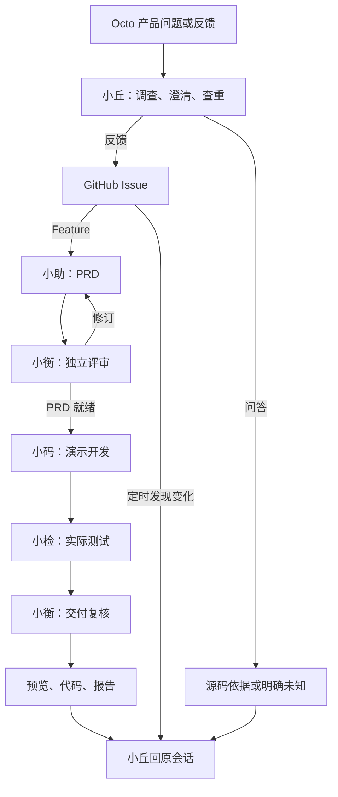

# Steward · Octo 产品管家与交付团队

**从一个产品问题，到有依据的答复、可追踪的需求和可操作的演示。**

Steward 在 OpenClaw 上运行五个 Agent，通过 Octo 接收问题和反馈，用本仓库保存 Issue、PRD、独立评审、演示代码与测试记录。Agent 负责调查与判断，后台 Worker 根据真实状态自动交接工作。

[项目介绍](docs/overview.md) · [打开真实演示](https://90le.github.io/steward-feedback/prototypes/issue-8/prd-3-03a0a091af3b/index.html) · [查看需求池](https://github.com/90le/steward-feedback/issues) · [交付与验证](docs/delivery.md)

## 一条自动接续的流程

PRD 通过后，已启用的自动开发流程接续工作，**不需要在群里逐个 @ 指挥**。Bug 默认归档并跟踪；Feature 才进入 PRD 流程。评审或测试不通过时修订，超出自动修订范围则提出具体待决问题。完整失败分支见[协作流程](docs/workflow.md)。

## 五个角色，各自承担责任

| Agent | runtimeId | 职责 |
| --- | --- | --- |
| **Octo 小丘** | `support-public` | 产品问答、反馈澄清、语义查重、收单、状态解释与结果汇总。 |
| **Octo 小助** | `product` | PRD 起草与修订，只写用户目标、范围和可感知的验收标准。 |
| **Octo 小衡** | `reviewer` | 独立评审 PRD、知识和演示交付；针对具体版本提出意见。 |
| **Octo 小码** | `implementation` | 根据通过评审的 PRD，开发可运行的演示前端与后端。 |
| **Octo 小检** | `verification` | 独立编写并执行测试，提交可复跑的测试文件与结果。 |

Octo 小测是配置放行的外部联调提问 Bot，不属于这五个团队 Agent。GitHub 统一发布账号不代表产物作者；交付记录标明实际角色、`runtimeId`、运行 ID 和版本。

## 怎样使用

| 你想做什么 | 入口与行为 |
| --- | --- |
| 询问产品行为 | 在已接入群向小丘自然提问，或私聊小丘；源码结论应带路径、行号及提交链接。 |
| 反馈 Bug / Feature | 先[查已有事项](https://github.com/90le/steward-feedback/issues?q=is%3Aissue)，再向小丘描述，或填写 [Bug](https://github.com/90le/steward-feedback/issues/new?template=bug_report.yml) / [Feature](https://github.com/90le/steward-feedback/issues/new?template=feature_request.yml) 表单。 |
| 补充或查进展 | 在原 Issue 补充具体版本和问题；也可以向小丘询问事项编号对应的进度。 |
| 直接向其他角色发任务 | 仅配置负责人、观察者、放行 Bot 可用；群里需要原生 UID @，私聊按账号与用户隔离。 |

小丘无需被 @，但只参与相关产品问题、反馈与追问；闲聊、明确写给其他人的消息保持静默。普通人只通过小丘问答、反馈和查状态；其反馈可以进入固定自动流程，但不获得直接调度其他角色或批准产物的权限。未放行 Bot 全部静默，自家 Bot 不互相接话。详见[参与权限](docs/architecture.md#参与权限)。

## 已有真实样例

**[#8：投票发起人修改未截止投票的截止时间](https://github.com/90le/steward-feedback/issues/8)** 已经过 PRD 打回、修订和复审，再自动进入小码开发、小检实际测试、小衡复核与原会话回报。

- [PRD v3](https://github.com/90le/steward-feedback/issues/8#issuecomment-5555649074) · [独立评审](https://github.com/90le/steward-feedback/issues/8#issuecomment-5555650888)
- [五角色交付记录](https://github.com/90le/steward-feedback/issues/8#issuecomment-5558075155) · [前后端代码、测试和报告](docs/prototypes/issue-8/prd-3-03a0a091af3b/README.md)
- 独立 HTTP 测试 4 项通过；此样例额外完成前后端与静态预览两种模式、各 12 项浏览器操作检查。

公开 Pages 是静态模拟预览，下载代码后可运行演示后端。**PRD 就绪、演示完成、上游功能上线是不同状态。** 本仓库是需求池与演示产物库，不托管 Steward 运行源码或凭证，也不写入只读上游 [octo-server](https://github.com/Mininglamp-OSS/octo-server)。

## 项目文档

| 想了解什么 | 文档 |
| --- | --- |
| 三分钟讲清项目、设计取舍与亮点 | [项目介绍](docs/overview.md) |
| Gateway、Agent、Worker、数据与权限关系 | [架构与资源边界](docs/architecture.md) |
| 问答、收单、PRD、开发、定时追踪、人工求助 | [协作流程](docs/workflow.md) |
| 九域知识、源码版本、失效重审与引用 | [知识与证据](docs/knowledge.md) |
| 实际完成了什么，哪些尚未验证 | [交付与验证记录](docs/delivery.md) |
| 如何反馈、署名与提供安全资料 | [反馈指南](CONTRIBUTING.md) |
| 标签、关闭原因和产物阶段 | [标签与状态](docs/labels.md) |
| 起草、评审与交付记录 | [PRD 模板](docs/templates/prd.md) · [评审模板](docs/templates/review.md) · [交付模板](docs/templates/delivery.md) |

更新依据：2026-09-06 的 mvp-038 运行核验与公开产物。群内只发送结果、必要澄清或需处理的阻碍；无变化扫描不调用模型、不发消息。公开提交前请移除凭证、私聊原文、群号及个人敏感信息；安全问题使用[上游安全政策](https://github.com/Mininglamp-OSS/octo-server/blob/main/SECURITY.md)规定的私密渠道。
