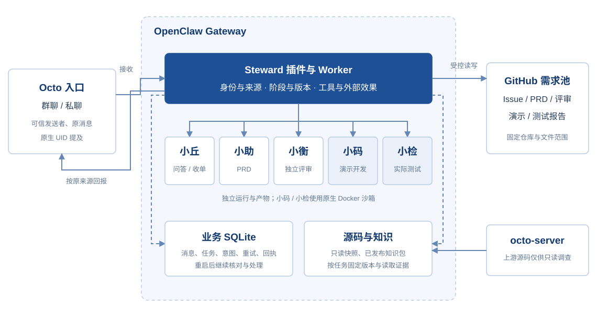
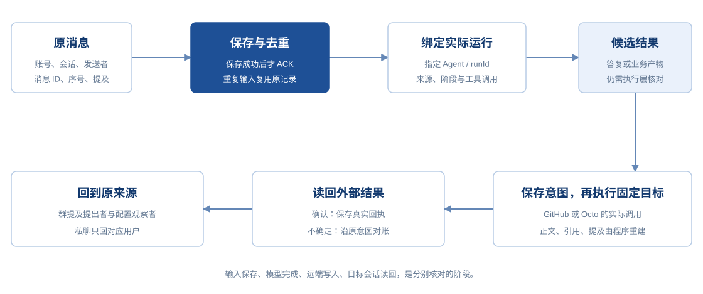
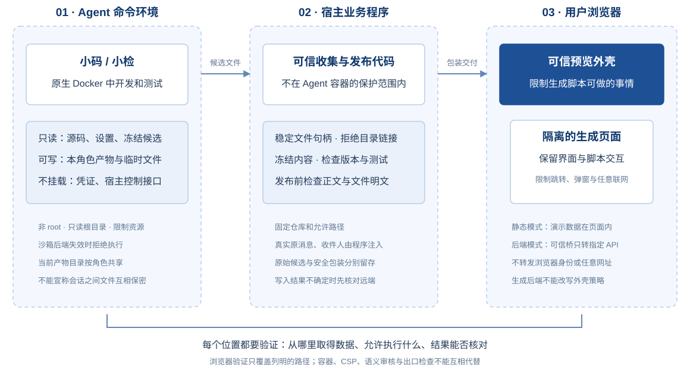

# 架构与资源边界

Steward 使用一个 OpenClaw Gateway、一个业务插件及其注册 Worker、一份业务 SQLite 数据库。五个角色有独立运行身份与工作区；Octo 是聊天入口，GitHub 保存公开业务记录和演示产物。

箭头是数据与调用关系，不表示 Agent 可以绕过 Worker 自行操作 GitHub 或向任意收件人发送消息。开发／测试也可使用按角色开放的只读业务工具，图中仅突出其命令执行环境。

## Agent 与 Worker 分工

| Agent 自主完成 | Worker 管理 |
| --- | --- |
| 多轮搜索、路径读取、续读、配置与调用关系调查 | 每次任务固定源码与知识版本 |
| 比较 Issue 正文、评论与语义重复 | 查询完整性、查重依据有效性与固定写入目标 |
| 理解需求、撰写和修订、独立内容判断 | 身份、原消息、运行、角色、阶段与版本绑定 |
| 沙箱内必要计算、开发和测试 | 冻结候选、实际复跑测试、限流、去重和外部回执 |

真实来源会在提示构建之前从本次已持租约的持久化入站作用域绑定，而不是依赖稍晚发生的 onAgentRunStart 才提供身份。没有当前作用域、来源不匹配或租约已结束时拒绝提前绑定；后台任务仍按独立的控制器任务约束处理。

现有六个业务工具为 `steward_source_search`、`steward_source_read`、`steward_source_answer`、`steward_issue_lookup`、`steward_feedback_submit`、`steward_work_status`，按角色开放。入口少不意味着只能调查一次：源码和 Issue 工具支持按需读取与继续调查。

## 参与权限

| 消息来源 | 小丘 | 小助、小衡、小码、小检 |
| --- | --- | --- |
| 配置负责人、观察者 | 相关群消息或私聊可交流、派职责内任务 | 群内原生 UID @；私聊自然响应；操作仍受角色和阶段限制 |
| 放行的外部 Bot，包括小测 | 同上 | 同上 |
| 未配置的普通人 | 产品问答、反馈收集、状态查询 | 不接受群 @ 或私聊任务，不对话、不批准 |
| 未放行的外部 Bot | 静默 | 静默 |
| 团队自己的 Bot | 不反向触发 | 不反向触发 |

授权按可信来源 UID 和配置判断，不能用昵称、文本假 @、自称负责人或“我是内部 Agent”取得权限。小丘对无关消息、明确写给其他人的请求保持静默；普通反馈进入固定自动流程，不代表提出者有直接调度权。后台派发依据已记录任务，不解析群里 Bot 对 Bot 的指令来推进。

GROUP.md 解释群内参与语义；确定的身份与原生提及限制在代码中执行。部署源由插件按群注入，五工作区已同步；Octo 群界面旧副本本轮未同步，单独修改界面不会更新这些程序权限。

## 资源与动作

| 资源 | 当前边界 |
| --- | --- |
| 公开源码、共享知识 | 只读；正式调查绑定本轮提交并返回证据 |
| 角色、灵魂、技能、权限 | 部署源维护，Agent 不可改写 |
| 小码、小检命令工具 | OpenClaw 原生 Docker；exec 强制 sandbox、无提权、网络关闭 |
| 计算与业务产物 | 每个角色自己的 `/artifacts` 可写，同角色会话共用此根；设置及工作区只读；冻结 `/candidate` 只读 |
| 沙箱 `/source` | 独立只读导航快照，不承诺自动追随上游；当前结论仍需版本绑定工具取证 |
| 宿主配置、凭证、原生会话历史目录、Docker socket | 不挂入 Agent 沙箱，不随命令权限开放 |
| GitHub / Octo 外部效果 | 插件按固定仓库、允许文件路径和真实来源执行，保留意图与回执 |

小丘、小助、小衡沿用受限读取与专用业务工具，未统一切换沙箱。沙箱不能限制宿主 Gateway 内插件，插件目标和凭证控制独立保留。该组合用于真实开发与测试，不等于全面安全审计或完整工具 A/B 已通过。

## 从输入到实际回执

`before_prompt_build` 提供规则和上下文；`before_tool_call` 仅检查已纳管的 Steward 业务工具，执行层再核对权限与调用来源；原生 read / exec / process 依靠 OpenClaw 策略及实际沙箱；业务状态机核对阶段与产物；出口和回执处理完成外部交付。提示引导、权限执行和语义质量验收分别承担责任。

## 三个执行位置分别保护

Agent 的 Docker 不会自动约束 Gateway 插件，也不会限制用户浏览器中运行的生成 JavaScript。可信程序分别检查文件收集、公开内容和预览包装；回执核验来自按原目标同步读回的平台消息，不等于收件设备已展示或用户已读。具体方法与有限验证见[安全说明](security.md)。

[返回首页](../README.md) · [流程与恢复](workflow.md)
