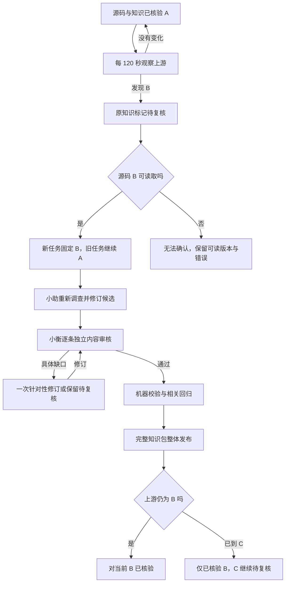

# 九域知识与可核验回答

知识帮助定位，当前产品结论须由对应版本源码支持。目标仓库 [octo-server](https://github.com/Mininglamp-OSS/octo-server)只读；README、历史知识和源码不一致时，应调查实际调用关系、配置及依赖。

## 覆盖范围

| 域 | 调查重点 |
| --- | --- |
| 认证与身份 | token、cookie、User Bot、App Bot、WebSocket 认证路径与适用场景 |
| 鉴权模型 | 组织角色、频道 ACL、Bot／Agent 门禁的作用范围 |
| 配置 | 配置文件、环境条件、启动检查、必填条件 |
| 业务模块 | 当前目录、注册、职责及启用条件，不仅按 README 推断 |
| API 与错误约定 | 响应结构、错误码、HTTP 状态与例外调用链 |
| IM 控制面 | octo-server 与 WuKongIM 的职责及请求流向 |
| Bot 与 Agent | app_bot、botfather、bot_provision、botidentity 及会话启动 |
| 存储与依赖 | 迁移、数据库、缓存、对象存储及实际使用位置 |
| 构建与发布 | Go 构建、Dockerfile 差异与部署仓库的关系 |

这些是调查导航，不是适用于所有版本的预设结论。

## 每条结论的证据

回答使用 `来源: <相对路径>#L<起>-L<止>`，并提供固定 commit 永久链接。本轮搜索、直接读取、续读、配置及调用关系调查绑定同一个提交。程序核对路径、范围、片段与实际读取；模型须解释这些证据如何支持用户所问的结论。

搜索只显示部分内容时可继续读取，不知道路径时先定位目录和文件。历史比较明确列出版本。源码 main 与某个部署实例分开：没有部署版本及配置证据，不推断线上已经使用该实现。

## 分开记录版本与核验

| 记录 | 含义 |
| --- | --- |
| 最近成功观察的上游提交与时间 | 那次已确认观察到什么，不代表永远最新 |
| 本地实际可读源码提交 | 可供新任务读取的版本 |
| 任务源码快照与知识包版本 | 本轮实际使用什么，后台切换不让本轮混用 |
| 知识内容审核版本与时间 | 对哪个提交完成内容审核，生成时间不能替代 |
| 最后尝试、刷新错误、待审目标 | 失败和待办独立保留，不刷新成功核验时间 |

明确问“最新”，或成功核验时间超过周期时，先做有时限的上游检查；无法确认就说明已知版本与新鲜度限制。

## 上游更新之后

待复核期间旧知识只作历史资料和导航，当前结论重新读源码及必要调用关系；不能因旧引用几行没改就认定行为未变。可直接依据当前源码回答，不必等整包审核。澄清、反馈、无需新源码的 PRD 与通知继续。

生成脚本沿用旧答案、重算摘要或换链接，只能生成候选，不能更新内容审核指针。机器检查与语义审核分开；候选完整核验后整体发布，后续任务用同一发布包，旧任务保留版本。失败或重启保留上一完整包与真实待审状态。

2026-09-06，在提交 `49dc9fd97b49c6c9bad9a0abaefb0b48241e9601` 上完成 36 条结论的独立内容审核；发布包 `k-49dc9fd97b49-d68e7481f933a9522239`，审核时间 `2026-09-06T01:51:10.064Z`。五角色投影逐项一致，扩员没有刷新审核时间。

独立测试镜像曾完成 A 的上限 50 → B 的 100，经过失效、重审、发布与新任务读取。旧会话曾错误沿用 50；修正任务版本上下文后，后续任务重新读三文件链并回答 100，旧失败保留。该样本不证明所有更新场景均已全面验收，也不证明语义永远正确。

[返回首页](../README.md) · [验证范围](delivery.md)
