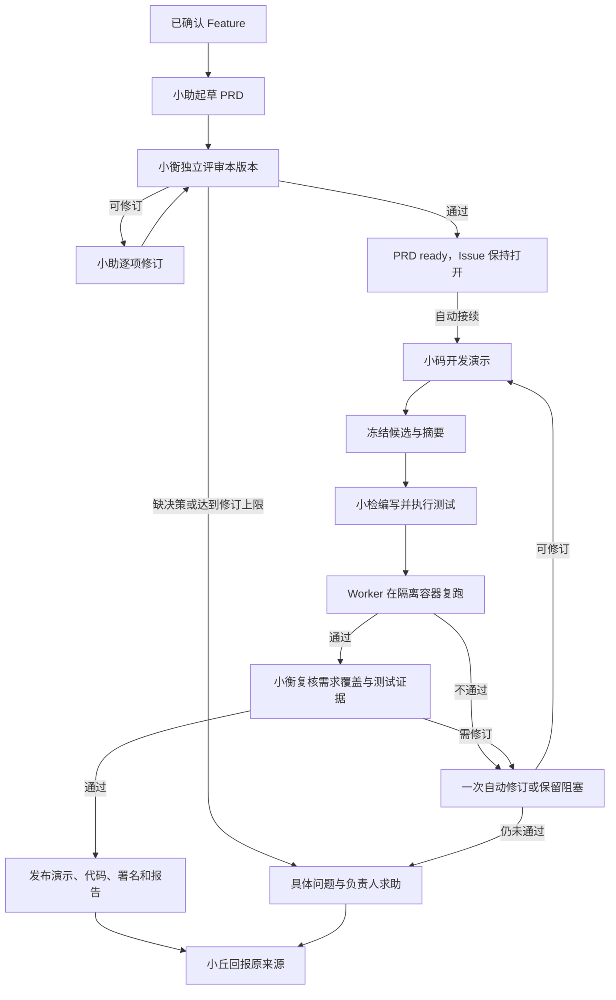

# 协作流程与自动追踪

## 问答与收单

小丘先判断消息是否属于自己的产品支持范围。咨询通过固定快照调查源码；有结论时给可核验来源，不确定时说明缺口与配置求助对象。需求不清楚时在原会话澄清，私有记录保留待补内容；正式 Issue 只包含整理后的公开业务事实。

查重读取打开和关闭的完整事项目录，再按相关候选进行语义比较，必要时续读正文与较早评论。候选显示少、目录不完整、网络失败是不同状态；超过 12 条不会永久阻止建单。哈希和关键词重合不能证明语义重复。多个提出者关联同一事项时，各自保留订阅与回执。

没有有效查重依据时不会自动建单。已保存反馈不等于已登记成功；需要后续有效查询和判断才能恢复相应意图。已有有效判断、但受限流影响的待办可以等待后继续；远端写入不确定时先核对原效果，不重复 POST。

## PRD、开发与独立测试

PRD 只写 What：谁遇到什么问题、目标、范围、约束和用户可感知的验收；不写内部字段、代码或数据库方案。首稿加一次自动修订，最多两轮评审；后续实质补充可开启新版本。

开发与测试另有产物。小码生成演示前后端和说明；小检独立写测试并执行；程序复跑冻结测试，要求成功退出和实际通过项，再交小衡复核。仅“模型运行完”“报告说通过”不能发布。

首次启用自动开发时，旧 ready PRD 建立基线，仅将选定 #8 补做一次，避免批量重复开发；以后新就绪 PRD 和新通过版本自动接续。任务按版本去重，PRD 改变时不能把旧候选发布为新版。每阶段记录实际 Agent、runtimeId、runId、版本与结果；历史产物保留原作者。

Pages 发布固定目录静态预览，另保存 `server.mjs`、说明、独立测试与报告。公网预览使用模拟数据；下载后启动服务才是前后端演示，不等于 Octo 生产实现。

## 无人提醒也会执行的扫描

注册在 Gateway 内的 Worker 每 **120 秒**检查源码及 GitHub。这是持续运行服务，不依赖用户发“去扫一下”，也不通过 Bot 互相 @。源码刷新和 GitHub 扫描分别处理故障。

| 发现的真实变化 | 后续动作 |
| --- | --- |
| 外部新建 Feature，或添加兼容 feature 标签 | 识别需求，进入适当的 PRD 阶段 |
| Issue 正文或评论变化，包括较早评论修改 | 比较真实 updated_at、评论 ID／内容和已处理版本，必要时修订 |
| PRD 新版本独立评审通过 | 自动进入演示开发流程 |
| Issue 关闭、重开、关闭原因变化 | 按实际原因向原订阅来源回报 |
| 上游源码提交变化 | 确认可读、知识失效并进入独立复核 |
| 没有变化 | 保存扫描记录，不调用模型、不发群消息、不重做产物 |

Issue 时间依据来自真实 GitHub 字段，不编造 Issue 的 Git commit。评论逐页读取并检查完整性；条件请求、缓存和在途合并减少请求，缓存命中时间不能冒充新核验时间。限流依实际响应头等待，重启保留等待，不换 Key 绕过限制。

运行记录应能核对开始／结束、完整性、变化数量、模型调用和任务数、失败或等待原因。已有三轮无变化样本见[交付记录](delivery.md)，手动命令不代替自动扫描证据。

## 结果与人工求助

群回复与通知使用持久化的原消息来源，原生提及提出者及配置负责人／观察者；私聊沿原会话回复，不把私聊正文复制到群里。消息 ID 按字符串处理，不用“最近一条消息”猜收件人。

| 情况 | 表达与处理 |
| --- | --- |
| 证据不足、实例状态未知 | 明确“我不确定”，说明已知范围、配置负责人及需补的脱敏证据 |
| PRD 多轮后仍有关键分歧 | 列出待决问题，保持待补状态，请负责人决策 |
| 持续失败至少 3 次且累计 5 分钟，或久等 10 分钟 | 记录并定向通知，同一阻塞跨重启去重 |
| completed 关闭 | 按完成关闭；无发布证据不声称已上线 |
| not_planned / 重复 / 未复现 / 原因未知 | 分别说明，不统一包装为“已修复” |
| 发送结果不确定 | 保留状态、核对回执，不把内部任务完成当送达 |

负责人取自 `defaultNotificationOwnerUid` 与 `observerUids`，模型不能任意选人。私聊持续故障可另给固定负责人发送不含私聊身份、正文和引用的摘要。通知送达仅代表求助已发出，尚无完整人工接手工单系统；Gateway 或 Octo 不可用时不能保证即时通知。没有产出时不发送“正在检查”“一切正常”等过程消息。

[返回首页](../README.md) · [标签语义](labels.md) · [知识生命周期](knowledge.md)
